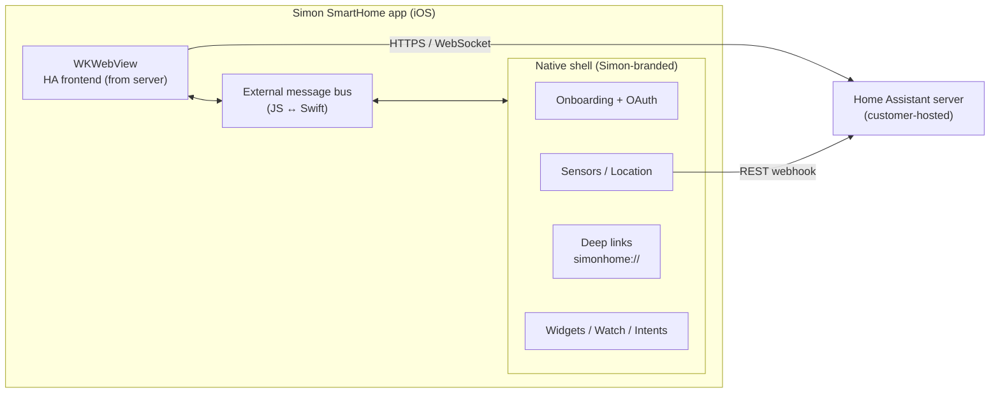
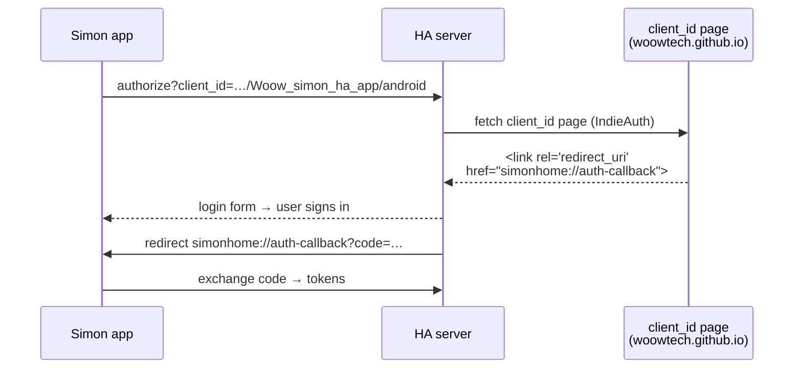
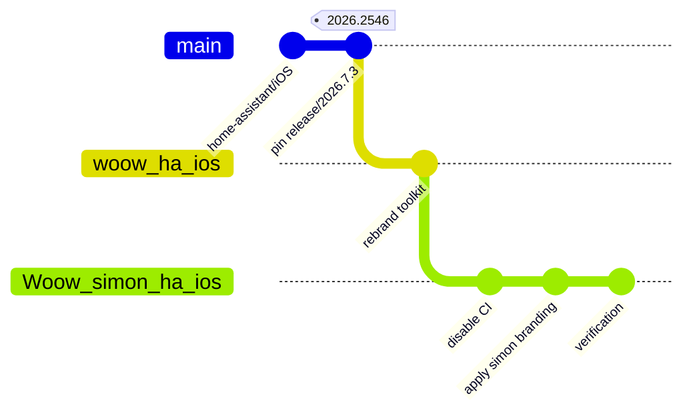
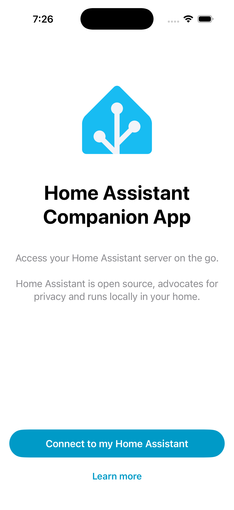
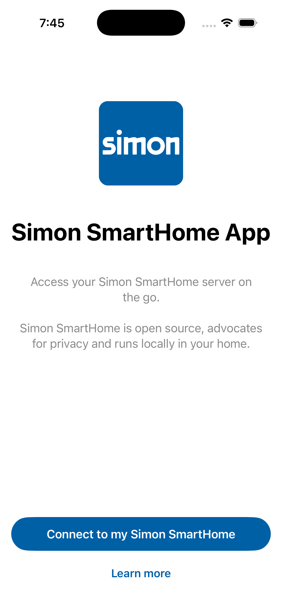
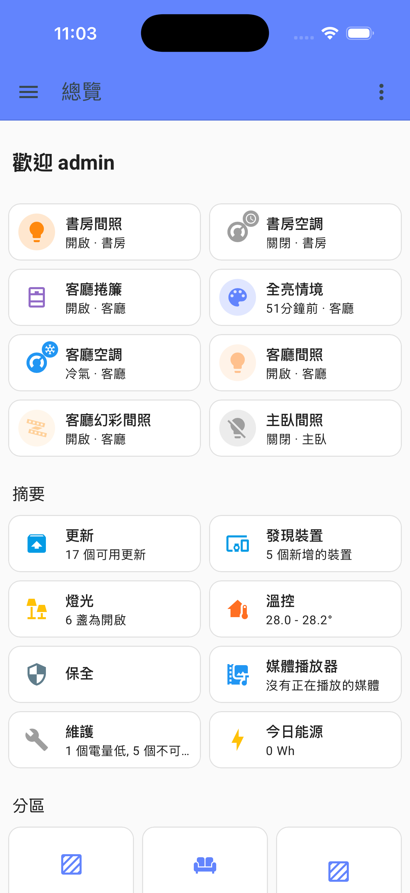
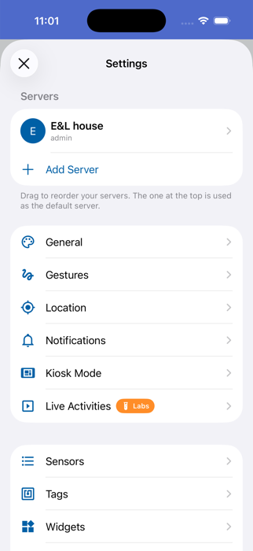
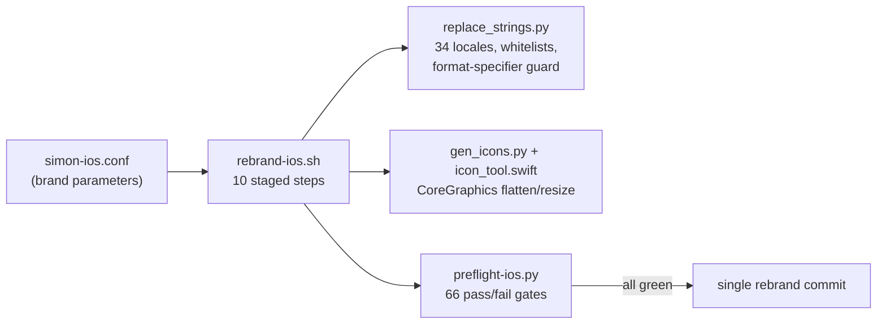

<p align="center">
  
</p>

<h1 align="center">Simon SmartHome — iOS App</h1>

<p align="center">
  <strong>White-label Home Assistant companion app for the Simon SmartHome ecosystem</strong><br/>
  Native iOS shell (onboarding · OAuth · sensors · deep links · widgets) around the Home Assistant web frontend
</p>

<p align="center">
  <a href="#overview">Overview</a> &bull;
  <a href="#architecture">Architecture</a> &bull;
  <a href="#screenshots">Screenshots</a> &bull;
  <a href="#repository-layout">Layout</a> &bull;
  <a href="#building">Building</a> &bull;
  <a href="#verification-status">Verification</a> &bull;
  <a href="#white-label-toolkit">Toolkit</a> &bull;
  <a href="README_zh-TW.md">中文文件</a>
</p>

<p align="center">
  
  
  
  
  
  
</p>

---

## Overview

**Simon SmartHome iOS** is a white-label build of the official
[Home Assistant Companion app for Apple platforms](https://github.com/home-assistant/iOS),
rebranded end-to-end for the Simon SmartHome product line — the iOS counterpart of
[`Woow_simon_ha_app`](https://github.com/WOOWTECH/Woow_simon_ha_app) (Android).

The app is a native Swift shell around a `WKWebView` that renders the Home Assistant
frontend served by the customer's own server. Everything user-visible in the native
shell — app icon, launch screen, onboarding, OAuth identity, URL scheme, accent color,
34 localizations — carries Simon branding; the web dashboard inside the WebView comes
from the server and is covered by the separate server-side white-label track.

| | |
|---|---|
| **Bundle ID** | `com.simon.home` (Release) / `com.simon.home.dev` (Debug — both installable side by side) |
| **URL scheme** | `simonhome://` (deep links + OAuth callback, unified across Debug/Release) |
| **OAuth client** | `https://woowtech.github.io/Woow_simon_ha_app/android` (shared with Android; declares `simonhome://auth-callback`) |
| **Brand color** | `#0060A6` |
| **Upstream pin** | `home-assistant/iOS` tag `release/2026.7.3/2026.2546` (commit `70e675a8`, 2026-07-28) |
| **Verified against** | Home Assistant Core 2026.4.2 on HA OS 18.1 (`woowtech-ha.woowtech.io`) |

---

## Architecture

### App structure

The primary UI is the Home Assistant web frontend in a `WKWebView`; native Swift code
wraps it with platform integrations. A JavaScript message bus connects the two worlds.



**Explanation** — the WebView talks to the customer's Home Assistant server over
HTTPS/WebSocket for the dashboard; native modules (sensors, widgets, deep links) call
the same server through its REST/WebSocket APIs. The native shell is the entire
branding surface of this repo; the frontend inside the WebView belongs to the server.

### OAuth sign-in chain



**Explanation** — Home Assistant validates the redirect URI against the page hosted at
the `client_id` URL (IndieAuth-style). The client page is shared with the Android app
and already declares `simonhome://auth-callback`, so one page serves both platforms.
This is the single most fragile link in any HA white-label; it is covered by
preflight checks and was verified live against `woowtech-ha.woowtech.io`.

### Fork topology



**Explanation** — upstream is pinned (no rolling merges; security fixes are cherry-picked
manually). [`woow_ha_ios`](https://github.com/WOOWTECH/woow_ha_ios) is the shared base
holding the rebrand toolkit; each brand repo (this one, `apporo` next) is seeded from
the base with full history and branded by one scripted run. Divergence from upstream is
ledgered in [`docs/fork-divergence.md`](docs/fork-divergence.md).

---

## Screenshots

| Upstream baseline | Simon onboarding |
|---|---|
|  |  |
| Phase 1 baseline — the unmodified upstream app built from the pinned tag, proving the toolchain before any branding. | The same screen after the one-shot rebrand: Simon icon, name, copy, and `#0060A6` accent — no Home Assistant branding remains in the native shell. |

| Live dashboard | Native settings |
|---|---|
|  |  |
| Connected to the real server (`woowtech-ha.woowtech.io`, HA Core 2026.4.2): overview dashboard with live entities and real-time WebSocket state updates. Reached via the `simonhome://navigate/lovelace/0` deep link. | Native settings after OAuth sign-in — server "E&L house" onboarded; all native chrome is brand-clean. |

More evidence (deep-link dialogs, per-step captures) in
[`docs/verification/`](docs/verification/) with the full
[Phase 4 report](docs/verification/phase4-report.md).

---

## Repository Layout

All targets/modules live at the repository root, mirroring upstream:

| Path | What it is |
|---|---|
| `Sources/App/` | Main iOS app target — WebView shell, onboarding, OAuth, settings |
| `Sources/Shared/` | Cross-platform core: `AppConstants`, environment (`Current` DI), persistence (GRDB + Realm), design system |
| `Sources/Extensions/` | Widgets, Share, Intents, Matter, Notification*, PushProvider app extensions |
| `Sources/WatchApp/` + `Sources/Watch/` | watchOS app (builds; out of acceptance scope) |
| `Sources/CarPlay/`, `Sources/MacBridge/`, `Sources/Launcher/` | CarPlay / macOS Catalyst support (out of scope, kept compiling) |
| `Sources/PushServer/` | Vendored push-relay server (server-side; not shipped in the app) |
| `Configuration/` | xcconfig layers — `Brand.xcconfig` (generated), dual-track entitlements `dev/` + `release/` |
| `Tools/brand/` | **White-label toolkit** — see [below](#white-label-toolkit) |
| `docs/` | Fork-divergence ledger, bundle-ID matrix, plans, verification evidence |
| `Tests/` | Upstream test suites (URL-scheme fixtures rebranded in the same pass) |

---

## Building

Requirements (all traps below are ledgered in `docs/fork-divergence.md`):

- **Xcode 26.6+** with the **watchOS platform downloaded** (the App scheme embeds a
  Watch app; scheme validation fails without it)
- **CocoaPods via Homebrew** (`brew install cocoapods`, then install the plugin into
  its gem home: `cocoapods-acknowledgements`). The pinned tag predates upstream's
  pods-removal; do not fight rbenv/ruby 3.1.2 — it does not compile under Xcode 26's clang
- `brew install swiftlint swiftformat` (a build phase hard-fails without them)

```bash
pod install
DEVELOPER_DIR=/Applications/Xcode.app/Contents/Developer \
xcodebuild -workspace HomeAssistant.xcworkspace -scheme App-Debug \
  -destination 'platform=iOS Simulator,name=iPhone 17' build
```

Open `HomeAssistant.xcworkspace` (never the `.xcodeproj`). For device builds create the
git-ignored `Configuration/HomeAssistant.overrides.xcconfig` with your
`DEVELOPMENT_TEAM`; Debug builds automatically use the **dev entitlements track**
(APNs/associated-domains/NFC/Siri stripped) so a free Personal Team can sign the app.

---

## Verification Status

| Phase | Scope | Status |
|---|---|---|
| 1 | Upstream baseline build + run (iPhone 17 simulator) | ✅ 2026-08-15 |
| 2 | Seeding, CI disabled, brand config layer, bundle-ID matrix | ✅ ([matrix](docs/bundle-id-matrix.md)) |
| 3 | One-shot rebrand — 3 934 strings / 139 files / 34 locales, 79 asset sets, dual-track entitlements; **66/66 preflight checks** | ✅ |
| 4 | Simulator end-to-end: onboarding → OAuth → live dashboard → `simonhome://` deep link | ✅ ([report](docs/verification/phase4-report.md)) |
| 5 | Physical iPhone install + 8-category acceptance smoke | ⏳ pending (needs paid-team-free signing session) |

Out of scope this cycle (by decision): remote push notifications, Apple Watch
acceptance, App Store submission, universal links (`aiot.simon.io` AASA).

---

## White-label Toolkit

The rebrand is **one scripted, verified, repeatable run** — no hand edits:



Lives in [`Tools/brand/`](Tools/brand/) (developed in the base repo
[`woow_ha_ios`](https://github.com/WOOWTECH/woow_ha_ios), reusable for the next brand —
see its `docs/apporo-reuse.md`). The replacement inventory
([`Tools/brand/rebrand-inventory.md`](Tools/brand/rebrand-inventory.md)) was produced by
an 8-way parallel source sweep and the toolkit survived a 5-lens adversarial review
before its first real run.

---

## License & Attribution

This project is a modified distribution of **Home Assistant Companion for iOS**,
© Home Assistant contributors, licensed under the
[Apache License 2.0](LICENSE.md). Upstream attribution and the in-app open-source
acknowledgements page are intentionally preserved. This repository does not submit
changes upstream (Open Home Foundation policy on autonomous-agent contributions).
