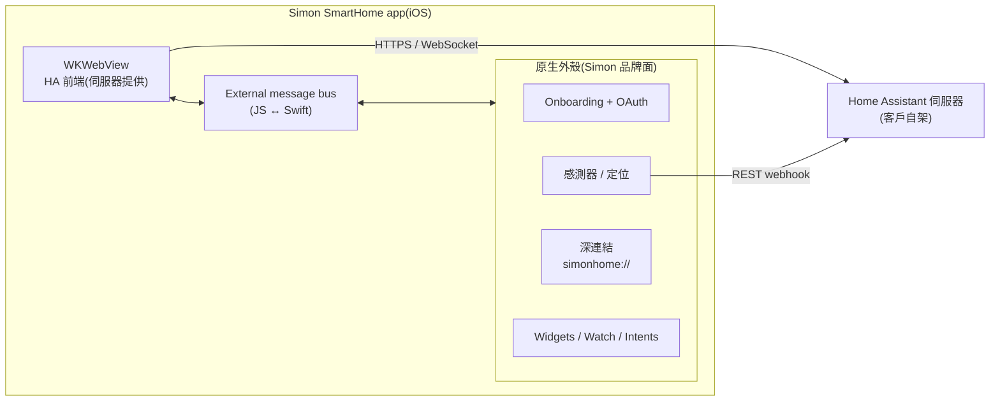
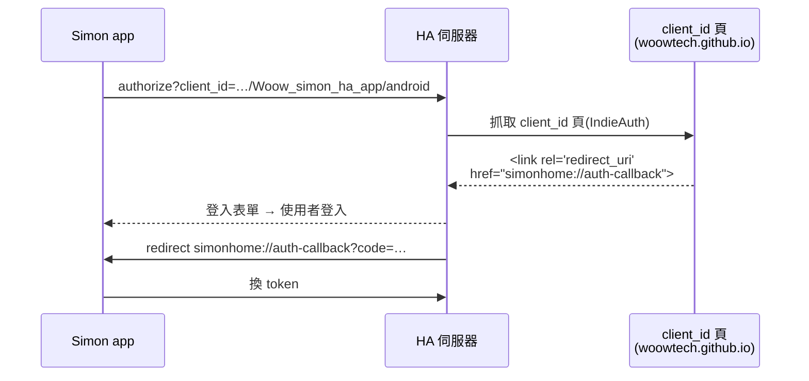
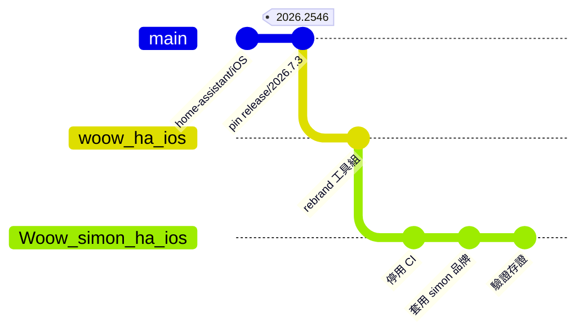
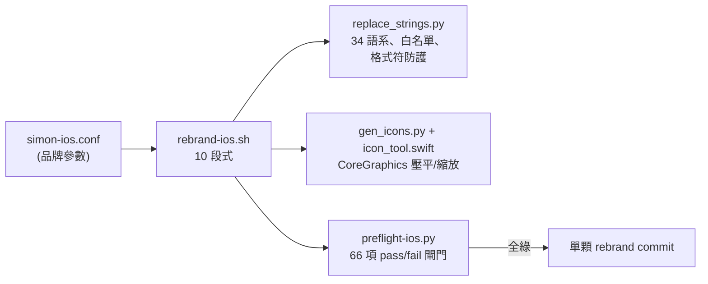

<p align="center">
  
</p>

<h1 align="center">Simon SmartHome — iOS App</h1>

<p align="center">
  <strong>Simon SmartHome 生態系的白牌 Home Assistant 隨行 App</strong><br/>
  原生 iOS 外殼(onboarding · OAuth · 感測器 · 深連結 · widgets)+ Home Assistant 網頁前端
</p>

<p align="center">
  <a href="#總覽">總覽</a> &bull;
  <a href="#架構">架構</a> &bull;
  <a href="#截圖">截圖</a> &bull;
  <a href="#倉庫結構">結構</a> &bull;
  <a href="#編譯">編譯</a> &bull;
  <a href="#驗證狀態">驗證</a> &bull;
  <a href="#白牌工具組">工具組</a> &bull;
  <a href="README.md">English</a>
</p>

<p align="center">
  
  
  
  
  
  
</p>

---

## 總覽

**Simon SmartHome iOS** 是官方
[Home Assistant Companion(Apple 平台)](https://github.com/home-assistant/iOS)
的白牌版本,對應 Android 端的
[`Woow_simon_ha_app`](https://github.com/WOOWTECH/Woow_simon_ha_app)。

App 本體是包著 `WKWebView` 的原生 Swift 外殼,WebView 內渲染客戶自架伺服器提供的
Home Assistant 前端。原生外殼所有使用者可見之處——app icon、啟動畫面、onboarding、
OAuth 身分、URL scheme、主色、34 個語系——全數 Simon 品牌化;WebView 內的儀表板
來自伺服器,屬另案的 server 端白牌軌道。

| | |
|---|---|
| **Bundle ID** | `com.simon.home`(Release)/ `com.simon.home.dev`(Debug,可並存安裝) |
| **URL scheme** | `simonhome://`(深連結 + OAuth callback,Debug/Release 統一) |
| **OAuth client** | `https://woowtech.github.io/Woow_simon_ha_app/android`(與 Android 共用,已宣告 `simonhome://auth-callback`) |
| **品牌色** | `#0060A6` |
| **上游 pin** | `home-assistant/iOS` tag `release/2026.7.3/2026.2546`(commit `70e675a8`,2026-07-28) |
| **驗證環境** | Home Assistant Core 2026.4.2 / HA OS 18.1(`woowtech-ha.woowtech.io`) |

---

## 架構

### App 結構

主 UI 是 `WKWebView` 內的 HA 前端,原生 Swift 以 JavaScript message bus 與之互通:



**說明**——WebView 走 HTTPS/WebSocket 取得儀表板;原生模組(感測器、widgets、深連結)
呼叫同一台伺服器的 REST/WebSocket API。本 repo 的品牌化範圍就是原生外殼;
WebView 內的前端字樣屬伺服器端。

### OAuth 登入鏈路



**說明**——HA 以 IndieAuth 方式向 `client_id` 網址上的頁面驗證 redirect URI。
client 頁與 Android 共用、已宣告 `simonhome://auth-callback`,一頁服務雙平台。
這是所有 HA 白牌最脆弱的一環,已列入 preflight 檢查並對
`woowtech-ha.woowtech.io` 實測通過。

### Fork 拓撲



**說明**——上游 pin 死(不滾動 merge,安全修正手動 pick)。
[`woow_ha_ios`](https://github.com/WOOWTECH/woow_ha_ios) 是共用基底、住著 rebrand
工具組;各品牌 repo(本 repo,下一個是 apporo)從基底種入完整歷史後一鍵換裝。
與上游的偏離逐條記錄於 [`docs/fork-divergence.md`](docs/fork-divergence.md)。

---

## 截圖

| 上游基準線 | Simon onboarding |
|---|---|
|  |  |
| Phase 1 基準線——pin tag 直接編出的官方原版,先證明工具鏈可用再動手換裝。 | 一鍵換裝後的同一畫面:Simon icon、名稱、文案、`#0060A6` 主色,原生外殼零 HA 殘留。 |

| 實連儀表板 | 原生設定頁 |
|---|---|
|  |  |
| 連上真實伺服器(`woowtech-ha.woowtech.io`,HA Core 2026.4.2):總覽儀表板、真實實體、WebSocket 即時狀態更新;由 `simonhome://navigate/lovelace/0` 深連結導入。 | OAuth 登入完成後的原生設定頁——伺服器「E&L house」已接上;原生 UI 全數品牌乾淨。 |

更多存證(深連結對話框、逐步截圖)見 [`docs/verification/`](docs/verification/) 與
[Phase 4 驗證報告](docs/verification/phase4-report.md)。

---

## 倉庫結構

所有 target/模組沿用上游、置於倉庫根目錄:

| 路徑 | 內容 |
|---|---|
| `Sources/App/` | 主 iOS app target——WebView 外殼、onboarding、OAuth、設定 |
| `Sources/Shared/` | 跨平台核心:`AppConstants`、環境(`Current` DI)、持久層(GRDB + Realm)、design system |
| `Sources/Extensions/` | Widgets、Share、Intents、Matter、Notification*、PushProvider 等 app extensions |
| `Sources/WatchApp/` + `Sources/Watch/` | watchOS app(可編譯;不在本期驗收) |
| `Sources/CarPlay/`、`Sources/MacBridge/`、`Sources/Launcher/` | CarPlay / macOS Catalyst(不在範圍,保持可編) |
| `Sources/PushServer/` | 自架推播 relay(伺服器端,不進 app binary) |
| `Configuration/` | xcconfig 分層——`Brand.xcconfig`(產生)、entitlements 雙軌 `dev/` + `release/` |
| `Tools/brand/` | **白牌工具組**——見[下方](#白牌工具組) |
| `docs/` | fork-divergence 帳本、Bundle ID 矩陣、計畫、驗證存證 |
| `Tests/` | 上游測試(URL scheme fixtures 同批換裝) |

---

## 編譯

環境需求(踩雷紀錄見 `docs/fork-divergence.md`):

- **Xcode 26.6+**,且 **watchOS platform 已下載**(App scheme 內嵌 Watch app,缺了過不了 scheme 驗證)
- **CocoaPods 用 Homebrew 版**(`brew install cocoapods`,再把 `cocoapods-acknowledgements`
  plugin 裝進它的 gem home)。pin tag 還在 pods 時代;別跟 rbenv/ruby 3.1.2 糾纏——Xcode 26 的 clang 編不過它
- `brew install swiftlint swiftformat`(build phase 硬需求)

```bash
pod install
DEVELOPER_DIR=/Applications/Xcode.app/Contents/Developer \
xcodebuild -workspace HomeAssistant.xcworkspace -scheme App-Debug \
  -destination 'platform=iOS Simulator,name=iPhone 17' build
```

一律開 `HomeAssistant.xcworkspace`(不是 `.xcodeproj`)。實機簽章:建 git-ignored 的
`Configuration/HomeAssistant.overrides.xcconfig` 填 `DEVELOPMENT_TEAM`;
Debug 自動走 **dev 精簡 entitlements**(拔 APNs/applinks/NFC/Siri),
免費 Personal Team 即可簽。

---

## 驗證狀態

| Phase | 範圍 | 狀態 |
|---|---|---|
| 1 | 上游基準線編譯+執行(iPhone 17 模擬器) | ✅ 2026-08-15 |
| 2 | 種入、停用 CI、品牌參數層、Bundle ID 矩陣 | ✅([矩陣](docs/bundle-id-matrix.md)) |
| 3 | 一鍵換裝——3 934 條字串 / 139 檔 / 34 語系、79 組資產、entitlements 雙軌;**preflight 66 項全過** | ✅ |
| 4 | 模擬器全鏈路:onboarding → OAuth → 實連儀表板 → `simonhome://` 深連結 | ✅([報告](docs/verification/phase4-report.md)) |
| 5 | 實機 iPhone 裝機 + 8 大類驗收冒煙 | ⏳ 待簽章(免費 Personal Team) |

本期明確不做(決策):遠端推播、Apple Watch 驗收、App Store 上架、
universal links(`aiot.simon.io` AASA)。

---

## 白牌工具組

換裝是**一次腳本化、可驗證、可重複**的流程——零手改:



工具住在 [`Tools/brand/`](Tools/brand/)(於基底 repo
[`woow_ha_ios`](https://github.com/WOOWTECH/woow_ha_ios) 開發,下一個品牌直接重用——
見其 `docs/apporo-reuse.md`)。置換清單
([`Tools/brand/rebrand-inventory.md`](Tools/brand/rebrand-inventory.md))由 8 路並行
原始碼掃描產出,工具組在首次真正執行前通過 5 視角對抗性審查。

---

## 授權與致謝

本專案為 **Home Assistant Companion for iOS**(© Home Assistant contributors,
[Apache License 2.0](LICENSE.md))之修改發行版。上游署名與 app 內開源致謝頁
刻意完整保留。本 repo 不回推上游(遵守 Open Home Foundation 對
autonomous-agent 貢獻之政策)。
